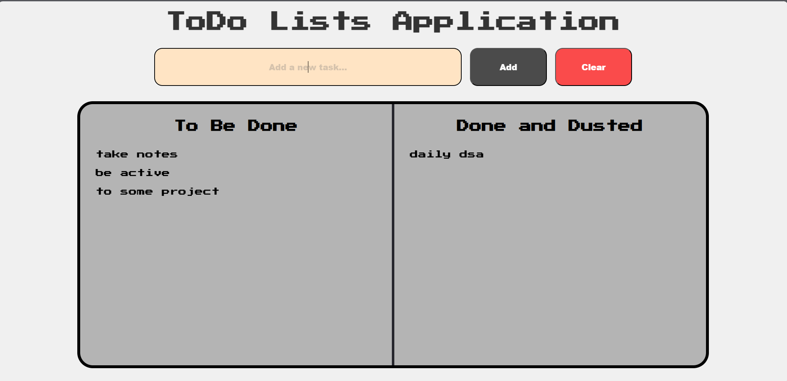

📝 ToDo Lists Application
A simple, stylish, and functional ToDo List web app built with HTML, CSS, and JavaScript.

This app lets you:

✅ Add new tasks

✅ Move tasks to a "Done and Dusted" list

✅ Automatically save tasks to localStorage

✅ Clear all tasks with one click

✅ Use the Enter key to quickly add tasks

✅ Automatically focus the input box for fast typing

✅ Visually separate pending and completed tasks

🚀 Features
✅ Add New Task
Input a task and press the Add button or Enter key.

Tasks appear under "To Be Done".

✅ Move Task to Done
Click a task in the To Be Done list.

It gets moved to the "Done and Dusted" list.

✅ Remove Task from Done
Click a task in the Done list.

It will be removed.

✅ Auto Save (localStorage)
All tasks are saved in your browser's local storage.

Data stays even after refreshing or closing the page.

✅ Clear All
Click the Clear button to remove all tasks from both lists.

Also clears localStorage.

✅ Input Focus
Input field automatically focused when the page loads or after adding a task.

Allows quick entry without using the mouse.

✅ Responsive and Styled
Custom scrollbars

Retro font using Google Fonts (Press Start 2P)

Clear visual separation of pending vs completed tasks

Styled buttons for interaction feedback

🧱 Tech Stack
HTML5 – structure

CSS3 – custom styling, scrollbars, layout

JavaScript – DOM manipulation, event handling, storage

📁 File Structure
bash
Copy
Edit
📁 todo-app/
├── index.html        # Main HTML file
├── todo.css          # All styles
├── todo.js           # App logic
└── README.md         # This file

🛠️ How to Use
Clone or download the project.

Open index.html in your browser.

Start typing tasks and interact with the app!

🔮 Possible Improvements
You could extend this project by adding:

✅ Edit task functionality

✅ Due dates and reminders

✅ Filters (All, Active, Completed)

✅ Drag-and-drop to reorder

✅ Themes (light/dark mode)

✅ Sound effects or animations

🙌 Credits
Built with ❤️ by [Your Name or GitHub Username]
Retro font powered by Google Fonts – Press Start 2P